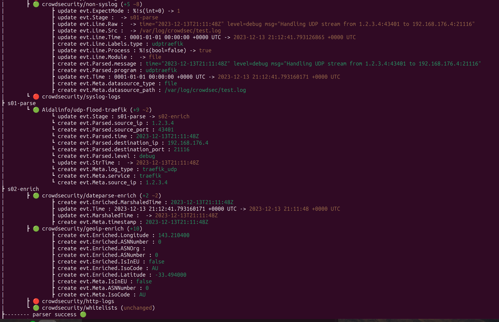

# crowdsecurity-udpflood-traefik
A parser and scenario for prevent UDP attack, analyze traefik log and ban with iptables bouncer

## Introduction

In development !

## Minimal Setup

https://www.crowdsec.net/blog/secure-docker-compose-stacks-with-crowdsec

Traefik configuration :

```yaml
    command:
      - --log.filePath=/var/log/crowdsec/traefik-tcpudp.log
      - --log.level=DEBUG # (Default: error) DEBUG, INFO, WARN, ERROR, FATAL, PANIC

    volumes:
      - /var/log/crowdsec/:/var/log/crowdsec/
```


Acquis.yaml crowdsec for traefik log :

```yaml
---
filenames:
- /var/log/crowdsec/traefik-tcpudp.log
labels:
  type: tcpudp-traefik
```

Copy past parser and scenario into your crowdsec folder configuration.
parser/s01-parse folder and scenarios folder

If you want testing parser 

### Test

create test.log with this content :
```
line: time="2023-12-13T21:11:48Z" level=debug msg="Handling UDP stream from 1.2.3.4:43401 to 192.168.176.4:21116
```

And you can try with this command :
```bash
cscli explain --file /var/log/crowdsec/test.log --type tcpudp-traefik -v
```

Result :



That's good, let's try it!

```bash
sudo hping3 --flood --udp -p 8888 1.2.3.4
```

Check with 
```bash
sudo cat /var/log/crowdsec-firewall-bouncer.log
```

You can view :
```
time="13-12-2023 20:42:18" level=info msg="1 decision added"
```
